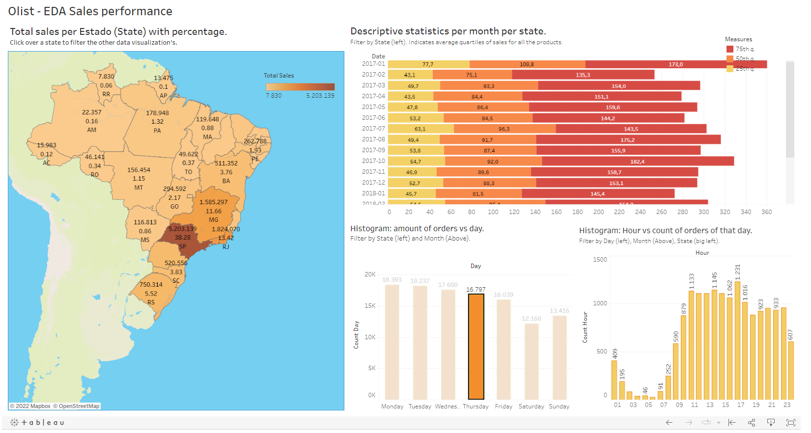

# Tableau and Power Bi Dahsboards for E-commerce Data

- [English Version](#English-Version) 
- [Spanish Version](#Spanish-Version)

## English Version
Not available yet.

## Spanish Version

Este proyecto contiene dashboards interactivos con datos del E-commerce brasileño OLIST.

El objetivo del proyecto es construir visualizaciones a partir de datos sobre ventas, precios, geolocalización, tiempos de entrega de productos y volumen agrupados por estado, temporalidad y categorías. Las visualizaciones apoyan la toma de decisiones de posibles stakeholders (por ej. sales manager, marketing manager, etc.).

### [Tableau Dashborad](https://public.tableau.com/app/profile/juan.diego.p.rez.sierra/viz/Olist-EDASalesperformanceV1/Dashboard2?publish=yes)

**Requerimientos**
* Descargar los datos disponibles vía [**Kaggle OLIST**](https://www.kaggle.com/datasets/olistbr/brazilian-ecommerce) y guardarlos en la carpeta data en el mismo folder del repositorio (dicha carpeta es después ignorada en el gitignore debido a su tamaño, de manera que no es visible en GitHub).
* Construimos la base de datos en PostgreSQL 14 utilizando Pgadmin4 como IDE.

**Notas**
Puede ver los resultados de visualización finales en [Tableau](https://public.tableau.com/app/profile/juan.diego.p.rez.sierra/viz/Olist-EDASalesperformanceV1/Dashboard2?publish=yes).

### Contenido
- [Highlights](#Highlights)
- [Queries](#Queries)

### Highlights

Separación de datos por región, mes día y hora de la semana. Se calcula la suma total de las ventas en cada caso.
Hay **botones para filtrar** los datos **interactivamente** en todos los niveles excepto el último: horas. Por ejemplo, si selecciona un estado, la información por mes y día se ven actualizadas para ese estado. Igualemente si selecciona un día de la semana la información varía acordemente para el estado y el mes. Igualmente sucede con mes. Los filtros seleccionados se mantienen en color y los no seleccionados en gris.

 ### Queries

Esta carpeta contiene scripts de SQL para:
1) Crear el esquema de la base de datos con llaves, indexes, constrainst, etc. Dado que la información es estática, no hay triggers ni procedures por el momento.
2) Filtrar y agrupar datos para la visualización correspondiente. De manera que las agrgaciones estadísticas se realizan en SQL y solamente se usa Tableau con fines de visualización y filtros.

### PowerBi Dashboard

No disponible aún.

